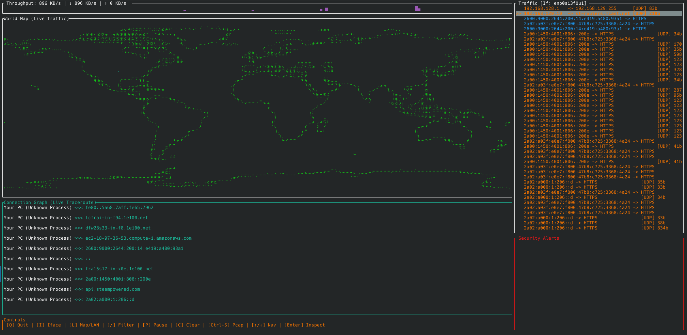

# TraceFlow: Terminal Internet Map 🛰️

Created by **Attila Peter Szucs**

TraceFlow is a high-performance, real-time Terminal User Interface (TUI) application designed to visualize and audit your machine's network traffic. Unlike traditional sniffers that present raw data, TraceFlow constructs a dynamic "map" of your connectivity: from the hardware on your local desk to the servers on the other side of the planet.




---

## 🌟 Features

### 1. Global Visualization
*   **High-Res Braille Map:** Utilizes Unicode Braille patterns to achieve 8x higher geographic resolution than standard ASCII.
*   **Real-Time Geo-Mapping:** Automatically projects destination IPs onto a world map using Latitude/Longitude coordinates.
*   **Directional Flow:** Animated pulses show data moving in real-time (`>>>` for uploads, `<<<` for downloads) with speeds linked to bandwidth intensity.

### 2. Deep Infrastructure Discovery
*   **Active Traceroute Engine:** Automatically discovers the full path of every connection (ISP hops, CDNs, backbone nodes) for IPv4 and IPv6.
*   **Latency Heatmaps & Jitter:** Color-coded RTT metrics and historical jitter histograms to identify connection stability at a glance.
*   **ASN & Org Identification:** Identifies the legal entity owning the remote server (e.g. "Google LLC", "Cloudflare").
*   **Service Name Mapping:** Automatically maps ports to common services (e.g. HTTPS, SSH, DNS).

### 3. Local System Integration
*   **Process Mapping:** Identifies which local application (Firefox, Spotify, etc.) is responsible for a connection: supported on both Linux and macOS.
*   **LAN Topology:** A dedicated "Local Mode" that performs ARP and NDP scanning to map all devices on your current subnet (IPv4/IPv6).
*   **Hardware Fingerprinting:** Identifies manufacturers via MAC OUI lookups (e.g. Apple, Tesla, HP) and resolves local names via mDNS.

### 4. Security & Performance
*   **Kernel-Level BPF Filtering:** Injects filters directly into the kernel for near-zero CPU overhead even at high-traffic volumes.
*   **Heuristic Alert Engine:** Persistent sidebar feed logging risks like cleartext credentials, VPN tunnels, or suspicious destination countries.
*   **High-Speed SHM IPC:** Uses a Shared Memory ring buffer for zero-copy communication between the backend and UI.
*   **Helper Resilience:** Heartbeat monitoring auto-restarts the backend helper process if it encounters a critical error.

---

## 🛠️ How It Works

TraceFlow operates using a **Multi-Process Privilege-Separated Architecture**:

1.  **The Helper:** A minimal backend process (`traceflow-helper`) captures raw frames using the `pcap` library and executes privileged networking tasks.
2.  **Shared Memory:** Communication between the UI and Helper happens via a zero-copy Shared Memory ring buffer, bypassing standard pipe serialization bottlenecks.
3.  **The Engine:** A stateful manager correlates network sockets with system processes using the `sysinfo` crate for cross-platform compatibility.
4.  **The TUI:** Built with `Ratatui`, the interface renders at 20FPS with dynamic layouts and high-density Braille plotting.

---

## 🚀 Installation

TraceFlow is written in Rust and requires `libpcap` development headers.

### Prerequisites
#### Arch Linux
```bash
sudo pacman -S libpcap rustup
```

#### macOS
```bash
brew install libpcap
```

### Automatic Secure Install
The included `install.sh` script compiles the application and applies Linux **Capabilities** to the helper binary. This allows you to run TraceFlow **without sudo**.

```bash
git clone https://github.com/your-repo/TraceFlow.git
cd TraceFlow
chmod +x install.sh
./install.sh
```

---

## 🎮 Controls

| Key | Action |
| :--- | :--- |
| **`Q`** | Quit application |
| **`L`** | Toggle View (World Map vs. Local LAN Topology) |
| **`P`** | **Pause/Resume** the traffic stream (Freeze for inspection) |
| **`I`** | Switch Network Interface (Popup Menu) |
| **`/`** | Open Filter Bar (e.g. type `tcp`, `port 443`, or `host 8.8.8.8`) |
| **`C`** | Clear map and traffic history |
| **`Ctrl+S`** | Save a **PCAP Snapshot** of the last 1000 packets |
| **`↑ / ↓`** | Navigate through the Traffic Sidebar |
| **`Enter`** | **Deep Inspect** selected connection (Jitter, Hex Dump, ASN, Process) |
| **`Esc`** | Close any active popup or menu |

---

## ⚖️ License
This project is licensed under the MIT License. Use it responsibly for network diagnostics and security auditing.
